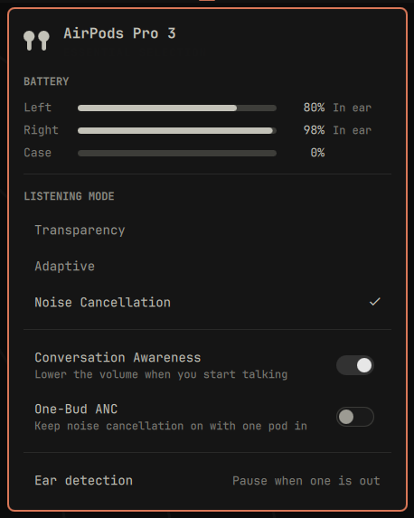
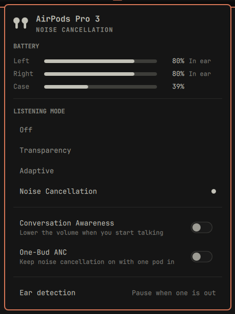
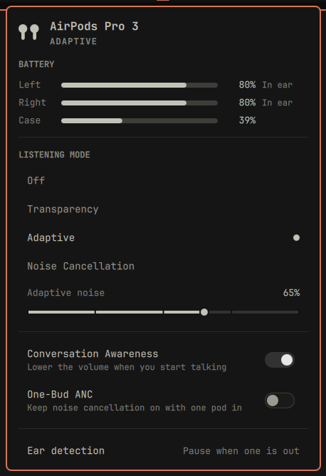
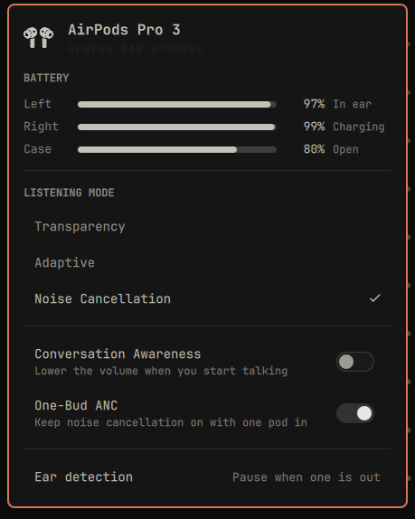
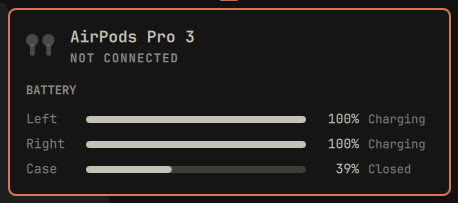
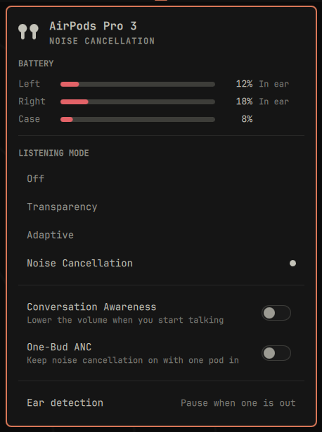
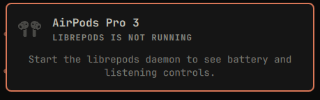

# omapods

AirPods in the Omarchy bar. Battery for each pod and the case, the listening
modes, adaptive noise level, Conversation Awareness, One-Bud ANC and ear
detection, drawn in Omarchy's own panel idiom.



## What it shows

- **Battery** for the left pod, the right pod and the case, each with a charging
  and in-ear hint. Nothing else on a Linux box knows these numbers: BlueZ does
  not expose `org.bluez.Battery1` for AirPods.
- **Listening mode**, and only the modes the device actually has. Adaptive is
  Pro-only, and AirPods Pro 3 dropped Off entirely, so the panel asks the daemon
  rather than assuming four rows.
- **Adaptive noise level**, shown only while Adaptive is the active mode.
- **Conversation Awareness** and **One-Bud ANC**, on the Pro models.
- **Ear detection**: pause when one pod is out, pause when both are out, or
  never pause.
- **Case lid**, when the case has broadcast its state.

## What it deliberately does not show

- **Volume and output device** live in the stock Audio panel, which already
  switches PipeWire sinks. Press `Tab` in this panel to walk to it.
- **Connect, disconnect and forget** live in the stock Bluetooth panel, and in
  `omarchy bluetooth device`.
- **Spatial Audio** has no renderer on Linux, so there is nothing to draw and
  no row for it.
- **Mic mode** is not an AirPods control. macOS applies Voice Isolation to the
  input stream itself, for any microphone, and the AAP protocol carries no mic
  packet. Input mute and input device live in the stock Audio panel.

## Screenshots

| | |
|---|---|
|  |  |
| Noise Cancellation, both pods in | Adaptive, with the noise level and Conversation Awareness on |
|  |  |
| One pod out of the case, lid open | Both pods charging, lid closed |
|  |  |
| Low battery | librepods not running |
|  | |
| Against a real AirPods Pro 3 | |

## Requirements

- **The daemon in [`daemon/`](daemon/), built and running.** It ships in this
  repository because nothing packaged will do: upstream librepods and every AUR
  package built from it carry no state file, no `status` verb, none of the
  `ca:`, `onebud:` or `adaptive:` verbs, and no AirPods Pro 3 model map, so the
  panel would stay hidden forever. See [daemon/UPSTREAM.md](daemon/UPSTREAM.md)
  for what it is, who wrote it and what was changed. Install builds it.
- AirPods paired to the machine through the usual Bluetooth flow.

The plugin does not poll. The daemon writes its status to
`$XDG_STATE_HOME/librepods/status.json` whenever that status changes, and
removes the file when it stops. The panel watches it, so an idle desktop runs no
processes at all on its behalf. `librepods-ctl` is used only when you actually
change something.

The plugin never talks to Bluetooth itself. If `librepods-ctl` is missing or
the daemon is not running, the panel says so in one line instead of drawing an
empty surface.

## Install

```bash
omarchy plugin add https://github.com/thisisgm/omarchy-pods --enable
omarchy bar move io.github.thisisgm.omapods
```

Then build the daemon out of the copy that just cloned, and hand it to systemd.
Building it needs `cmake`, `ninja`, `qt6-connectivity`, `qt6-tools`,
`qt6-declarative`, `pkgconf` and `libpulse`:

```bash
cd ~/.config/omarchy/plugins/io.github.thisisgm.omapods/daemon
cmake -B build -G Ninja && cmake --build build
cmake --install build --prefix ~/.local
systemctl --user enable --now librepods.service
```

`~/.local` is the prefix the unit expects, because it runs `%h/.local/bin/librepods`,
and Omarchy already puts `~/.local/bin` on `PATH`, which is where the panel finds
`librepods-ctl`. The unit is bound to `graphical-session.target`, so the daemon
comes back after a reboot.

## Remove

```bash
systemctl --user disable --now librepods.service
xargs rm -f < ~/.config/omarchy/plugins/io.github.thisisgm.omapods/daemon/build/install_manifest.txt
omarchy plugin remove io.github.thisisgm.omapods
```

The daemon installs into `~/.local`, so it outlives the plugin. CMake lists what it
put there in `install_manifest.txt`, which lives in the build tree, so that line has
to run before the plugin directory goes.

## Keyboard

| Key | Action |
|-----|--------|
| `j` / `k`, `↓` / `↑` | move between rows |
| `enter` / `space` | activate the current row |
| `←` / `→` | adjust the adaptive noise level |
| `o` | Off, on the models that have it |
| `t` | Transparency |
| `a` | Adaptive |
| `n` | Noise Cancellation |
| `c` | toggle Conversation Awareness |
| `b` | toggle One-Bud ANC |
| `e` | cycle ear detection |
| `r` | refresh |
| `tab` | move to the next panel |
| `esc` | close |

Left click opens the panel. Right click cycles the listening mode without
opening anything.

## Settings

| Setting | Default | Notes |
|---------|---------|-------|
| Hide when disconnected | on | Leaves the bar entirely rather than sitting there with nothing to say. |
| Path to librepods-ctl | empty | Leave empty to find it on `PATH`. |

## Tests

`Model.js` holds the parsing and formatting, with no QML imports, so it runs
outside the shell. The suite covers the shapes that bite: the objects the daemon
omits entirely, a pod it has stopped hearing from, an empty file, a line that is
not JSON, and a schema newer than this panel reads.

```bash
deno run --allow-read tests/model.test.js
```

## Credits

The hard part is not this panel. It is
[librepods](https://github.com/kavishdevar/librepods) by **Kavish Devar**, which
reverse-engineered Apple's AAP protocol over L2CAP and the BLE advertisement
path that carries battery, in-ear and case lid state. The daemon in `daemon/` is
a modified copy of his work, and this panel is a display for it.

## Support

If this saved you an afternoon, you can
[buy me a coffee](https://buymeacoffee.com/thisisgm).

## Licence

Two programs live here, and they are licensed separately because they are
separate works that talk over a state file and a command line.

| Path | Licence | |
|---|---|---|
| repository root, the bar widget | MIT | [LICENSE](LICENSE) |
| `daemon/`, a modified copy of librepods | GPL-3.0 | [daemon/LICENSE](daemon/LICENSE) |

Shipping both in one repository is aggregation, not combination, so the widget
stays MIT and the daemon stays GPL-3.0. What was modified, and the upstream
commit it was forked from, are recorded in
[daemon/UPSTREAM.md](daemon/UPSTREAM.md).
